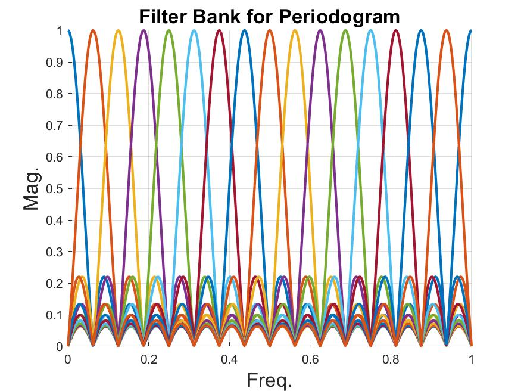

## MSA HW1

### Problem 1
For simplicity, assuming $\alpha=\hat{S}_{x,per}(e^{j2\pi{}f})$, $\beta=S_{x}(e^{j2\pi{}f})$ and $\mu=\mathbb{E}[\alpha]$. Notice that $\alpha$ is a random variable and $\beta$ and $\mu$ are deterministic. Also, $\alpha$, $\beta$, $\mu$ are are real.

(1) By definition $\text{MSE}(\alpha,\beta)=\mathbb{E}[|\alpha-\beta|^2]=\mathbb{E}[\alpha^2]-2\mathbb{E}[\alpha\beta]+\mathbb{E}[\beta^2]=\mathbb{E}[\alpha^2]-2\mu\beta+\beta^2$
(2) By definition $\text{Bias}(\alpha)^2=(\mu-\beta)^2=\mu^2-2\mu\beta+\beta^2$
(3) By definition $\text{Var}(\alpha)=\mathbb{E}[|\alpha-\mu|^2]=\mathbb{E}[\alpha^2]-2\mu^2+\mu^2=\mathbb{E}[\alpha^2]-\mu^2$
(4) From (1), (2), (3), it is clear that $\text{MSE}(\alpha,\beta)=\text{Bias}(\alpha)^2+\text{Var}(\alpha)$

### Problem  2
The magnitude response for the filter is as follows:

### Problem  3
$
\mathbb{E}[\frac{1}{NU}|\sum_{n_1=-\infty}^{\infty}x(n)w(n)e^{-j2\pi{}fn}|^2] \\
=\frac{1}{NU}\mathbb{E}[(\sum_{n_1=-\infty}^{\infty}x(n_1)w(n_1)e^{-j2\pi{}fn_1})(\sum_{n_2=-\infty}^{\infty}x^*(n_2)w^*(n_2)e^{j2\pi{}fn_2})] \\
=\frac{1}{NU}\sum_{n_1=-\infty}^{\infty}\sum_{n_2=-\infty}^{\infty}\mathbb{E}[x(n_1)x^*(n_2)]w(n_1)w^*(n_2)e^{-j2\pi{}fn_1}e^{j2\pi{}fn_2} \\
$
Let $k=n_1-n_2$ 
$= \frac{1}{NU}\sum_{n_1=-\infty}^{\infty}\sum_{k=-\infty}^{\infty}r_x(k)w(n_1)w^*(n_1-k)e^{-j2\pi{}fk} \\
= \frac{1}{NU}\sum_{k=-\infty}^{\infty}r_x(k)[\sum_{n_1=-\infty}^{\infty}w(n_1)w^*(n_1-k)]e^{-j2\pi{}fk} \\
$
Let $q(n)=w^*(-n)*w(n)\rightarrow{}q(k)=\sum_{n=-\infty}^\infty{}w^*(n-k)w(n)$ 
$
= \frac{1}{NU}\sum_{k=-\infty}^{\infty}r_x(k)q(k)e^{-j2\pi{}fk} \\
= \frac{1}{NU}S_x(e^{j2\pi{}f})*Q(e^{j2\pi{}f})
\\
= \frac{1}{NU}S_x(e^{j2\pi{}f})*|W(e^{j2\pi{}f})|^2
$
Since $w^*(-n)\xrightarrow{\text{DTFT}}W^*(e^{j2\pi{}f})$, 
$q(n)=w^*(-n)*w(n)\xrightarrow{\text{DTFT}}W^*(e^{j2\pi{}f})W(e^{j2\pi{}f})=|W(e^{j2\pi{}f})|^2$

### Problem  4
**a.**
(1) We prove that the parzen window is 4-times self-convolution of the rect window.
Let 
$w_\text{rect}(x)
=\begin{cases}
    \frac{2}{L}\sqrt{\frac{6}{L}},& \text{if } |x|\leq{}\frac{L}{4}\\
    0,              & \text{otherwise}
\end{cases}$
and let 
$w_\text{tri}(x)=\text{rect}(x)*\text{rect}(x)
=\begin{cases}
    \sqrt{\frac{6}{L}},& \text{if } |x|\leq{}\frac{L}{2}\\
    0,              & \text{otherwise}
\end{cases}$,
We define $h=\sqrt{\frac{6}{L}}$,

For $|x|\leq{\frac{L}{2}}$,we have
$w_\text{parzen}(x)=2(\frac{\sqrt{\frac{6}{L}}}{\frac{L}{2}})^2[\int_{x-\frac{L}{2}}^0[t-(x-\frac{L}{2})][t+\frac{L}{2}]dt + {\int_0^{\frac{x}{2}}[t-(x-\frac{L}{2})][\frac{L}{2}-t]dt}]=1-6\frac{x^2}{L^2}+6\frac{x^3}{L^3}$

For $\frac{L}{2}\leq{}|x|\leq{L}$, we have
$w_\text{parzen}(x)=(\frac{\sqrt{\frac{6}{L}}}{\frac{L}{2}})^2[\int_{x-\frac{L}{2}}^{\frac{L}{2}}[t-(x-\frac{L}{2})][\frac{L}{2}-t]dt=2(1-\frac{x}{L})^3$

(2) Since $w_\text{parzen}(x)=(w_\text{rect}*w_\text{rect}*w_\text{rect}*w_\text{rect})(x)$, we have the DTFT of parzen window as
$W_\text{parzen}(e^{j\omega})=|W_\text{rect}(e^{j\omega})|^4\sim{}[\frac{\sin(\frac{\omega{}L}{4})}{\sin(\frac{\omega{}}{4})}]^4\geq{0}$,
since $W_\text{rect}(e^{j\omega})\sim{}\frac{\sin(\frac{\omega{}L}{4})}{\sin(\frac{\omega{}}{4})}$

**b.**
Let $x=\frac{l}{L}\rightarrow{}Ldx=dl$, we have
$E_w=\int_{0}^{\frac{1}{2}}2w_p(l)dl+\int_{\frac{1}{2}}^{1}2w_p(l)dl$
$=\int_{0}^{\frac{1}{2}}2(1-6x^2+6x^3)^2Ldx+\int_{\frac{1}{2}}^{1}2(2(1-x)^3)^2Ldx=0.539286L\sim{}0.539L$
Therefore, the variance redunction ratio is $\frac{E_w}{N}\sim{}0.539\frac{L}{N}$

### Problem  5
$
\frac{1}{N}\mathbb{E}[|\sum_{n=0}^{N-1}e^{-j2\pi{}n}x(n)|^2]
\\= \frac{1}{N}\mathbb{E}[(\sum_{n_1=0}^{N-1}e^{-j2\pi{}n_1}x(n_1))(\sum_{n_2=0}^{N-1}x(n_2)e^{-j2\pi{}n_2})^*]
\\= \frac{1}{N}\mathbb{E}[\sum_{n_1=0}^{N-1}\sum_{n_2=0}^{N-1}e^{-j2\pi{}n_1}x(n_1)x^*(n_2)e^{j2\pi{}n_2}]
\\= \frac{1}{N}\mathbb{E}[\begin{bmatrix}
1 & e^{-j2\pi{}f} & e^{-j4\pi{}f} & \dots{} & e^{-j2(N-1)\pi{}f}
\end{bmatrix}
\begin{bmatrix}
x(0)x^*(0) & x(0)x^*(1) & x(0)x^*(2) & \dots{} & x(0)x^*(N-1)\\
\vdots{} & \vdots{} & \vdots{} & \ddots{} & \vdots{}\\
x(N-1)x^*(0) & x(N-1)x^*(1) & x(N-1)x^*(2) & \dots{} & x(N-1)x^*(N-1)\\
\end{bmatrix}
\begin{bmatrix}{}
1 \\ e^{j2\pi{}f} \\ e^{j4\pi{}f} \\ \vdots{} \\ e^{j2(N-1)\pi{}f}
\end{bmatrix}]
\\= \mathbf{v}^H(f)\frac{1}{N}
\begin{bmatrix}
r(0) & r(-1) & r(-2) & \dots{} & r(-(N-1))\\
\vdots{} & \vdots{} & \vdots{} & \ddots{} & \vdots{}\\
r(N-1) & r(N-2) & r(N-3) & \dots{} & r(0)\\
\end{bmatrix}
\mathbf{v}(f)\\
$
Therefore,
$\mathbf{P}= \frac{1}{N}
\begin{bmatrix}
r(0) & r(-1) & r(-2) & \dots{} & r(-(N-1))\\
\vdots{} & \vdots{} & \vdots{} & \ddots{} & \vdots{}\\
r(N-1) & r(N-2) & r(N-3) & \dots{} & r(0)\\
\end{bmatrix}$
### Problem  6
**a.**
$H(z)=\frac{1}{(1-\frac{1}{2}z^{-1}+\frac{1}{2}z^{-2})(1+\frac{1}{2}z^{-2})}=\frac{1}{(1-\frac{1+\sqrt{7}j}{4}z^{-1})(1-\frac{1-\sqrt{7}j}{4}z^{-1})(1+\frac{1}{\sqrt{2}}jz^{-1})(1-\frac{1}{\sqrt{2}}jz^{-1})}$
The z-plane plot is as follows, and the ROC is $|z|>\frac{1}{\sqrt{2}}$

**b.**
$\frac{X(z)}{V(z)}=H(z)=\frac{1}{(1-\frac{1}{2}z^{-1}+\frac{1}{2}z^{-2})(1+\frac{1}{2}z^{-2})}$
$\rightarrow{}X(z)(1-\frac{1}{2}z^{-1}+\frac{1}{2}z^{-2})(1+\frac{1}{2}z^{-2})=V(z)$
$\rightarrow{}X(z)(1-\frac{1}{2}z^{-1}+z^{-2}-\frac{1}{4}z^{-3}+\frac{1}{4}z^{-4})=V(z)$
$\rightarrow{}x(n)-\frac{1}{2}x(n-1)+x(n-2)-\frac{1}{4}x(n-3)+\frac{1}{4}x(n-4)=v(n)$

**c.**
$S_x(e^{j2\pi{}f})=|H(e^{j2\pi{}f})|^2S_v(e^{j2\pi{}f})
=|\frac{1}{(1-\frac{1}{2}e^{-j2\pi{}f}+\frac{1}{2}e^{-j4\pi{}f})(1+\frac{1}{2}e^{-j4\pi{}f})}|^2
=\frac{1}{[\frac{3}{2}-\frac{3}{2}cos(2\pi{}f)+cos(4\pi{}f)][\frac{5}{4}+cos(4\pi{}f)]}
$

### Problem  7

**a.**

**b.**

**c.**

**d.**

**e.**
Notice that the triangular is normalized for un-biased estimation.

