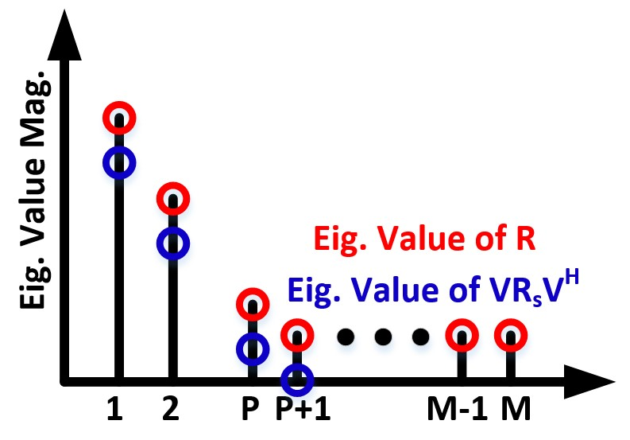
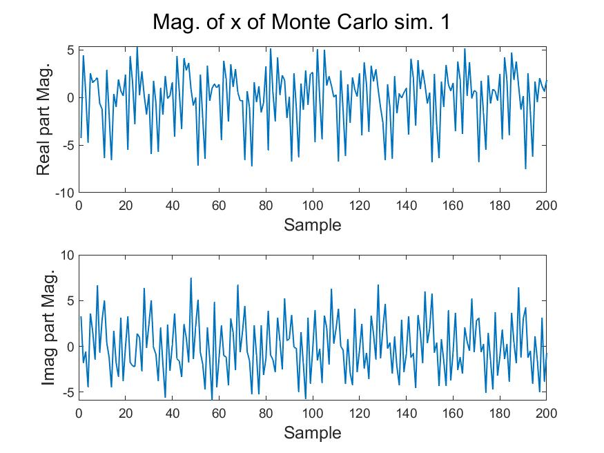
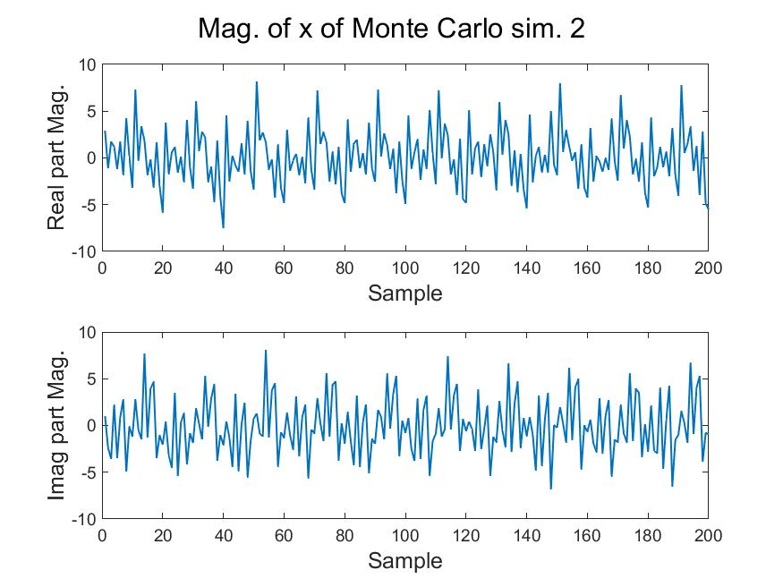
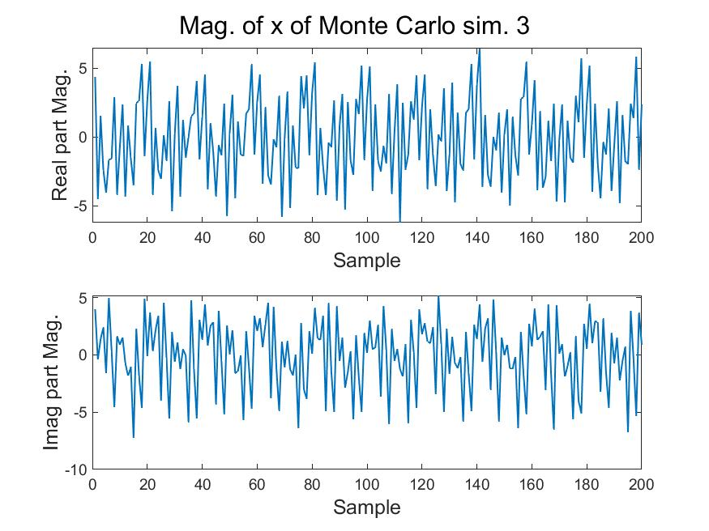
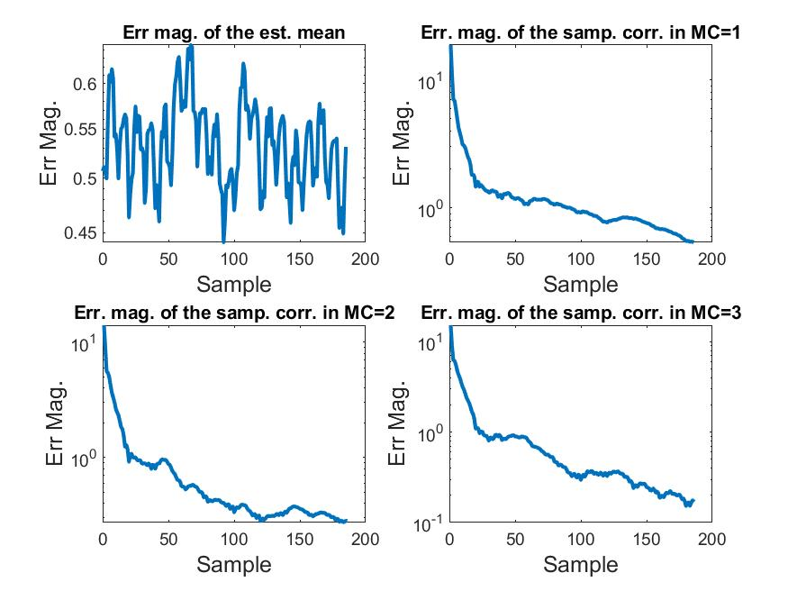
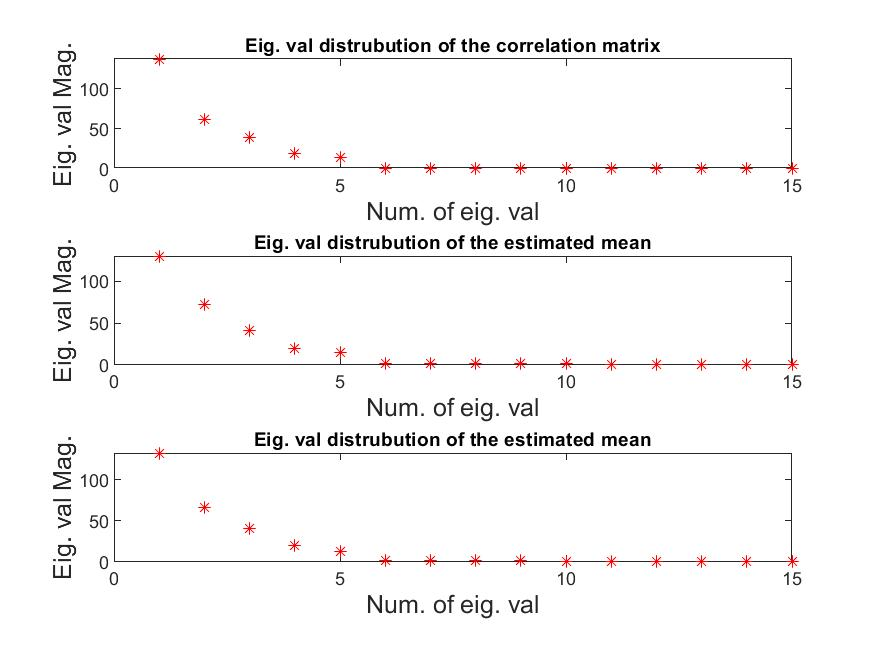
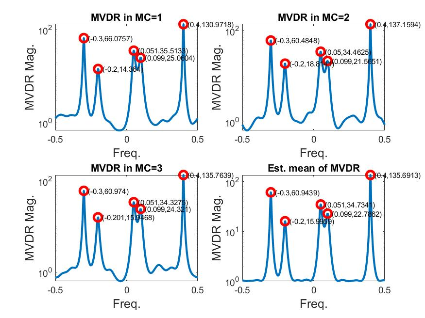
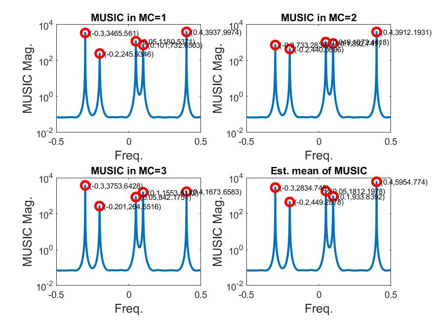

## MSA HW2

### Problem 1
**a.**
$\mathbb{E}[x(n)]=\mathbb{E}[A_1]e^{j2\pi{}f_1n}+\mathbb{E}[A_2]e^{j2\pi{}f_2n}+\mathbb{E}[w(n)]=0$

**b.**
$r(x)=\mathbb{E}[x(n)x^*(n-k)]=\mathbb{E}[(A_1e^{j2\pi{}f_1n}+A_2e^{j2\pi{}f_2n}+w(n))(A^*_1e^{-j2\pi{}f_1(n-k)}+A_2^*e^{-j2\pi{}f_2(n-k)}+w^*(n-k))]\\
=\mathbb{E}[(A_1e^{j2\pi{}f_1n}+A_2e^{j2\pi{}f_2n})(A^*_1e^{-j2\pi{}f_1(n-k)}+A_2^*e^{-j2\pi{}f_2(n-k)})]+\sigma_w^2\delta(k)\quad{}(\because{}\mathbb{E}[A_pw^*(n)]=0)\\
=\sigma^2e^{j2\pi{}f_1k}+\sigma^2e^{j2\pi{}f_2k}+\frac{\sigma^2}{3}e^{j2\pi{}(f_1n-f_2n+f_2k)}+\frac{\sigma^2}{3}e^{j2\pi{}(f_2n-f_1n+f_1k)}+\sigma_w^2\delta(k)$

**c.**
Since the autocorrelation function relates not only to the time difference $k$, $x(n)$ is not WSS

### Problem 2
**a.**
Since
$\begin{bmatrix}x(n)\\x(n+1)\\\vdots{}\\x(n+M-1)\end{bmatrix}
=\begin{bmatrix}
\sum_{p=1}^P\alpha_pe^{(\epsilon_p+j2\pi{}f_p)n}\\
\sum_{p=1}^P\alpha_pe^{(\epsilon_p+j2\pi{}f_p)(n+1)}\\
\vdots{}\\
\sum_{p=1}^P\alpha_pe^{(\epsilon_p+j2\pi{}f_p)(n+M-1)}
\end{bmatrix}
+\begin{bmatrix}w(n)\\w(n+1)\\\vdots{}\\w(n+M-1)\end{bmatrix}
=\begin{bmatrix}
1 & 1 & \dots & 1\\
e^{(\epsilon_1+j2\pi{}f_1)} & e^{(\epsilon_2+j2\pi{}f_2)} & \dots{} & e^{(\epsilon_P+j2\pi{}f_P)}\\
\vdots{}&\vdots{}&\ddots{}&\vdots{}\\
e^{(\epsilon_1+j2\pi{}f_1)(M-1)} & e^{(\epsilon_2+j2\pi{}f_2)(M-1)} & \dots{} & e^{(\epsilon_P+j2\pi{}f_P)(M-1)}\\
\end{bmatrix}
\begin{bmatrix}
\alpha_1e^{(\epsilon_1+j2\pi{}f_1)n}\\
\alpha_2e^{(\epsilon_2+j2\pi{}f_2)n}\\
\vdots{}\\
\alpha_Pe^{(\epsilon_P+j2\pi{}f_P)n}
\end{bmatrix}
+\begin{bmatrix}w(n)\\w(n+1)\\\vdots{}\\w(n+M-1)\end{bmatrix}$
We have
$\mathbf{V}=\begin{bmatrix}
1 & 1 & \dots & 1\\
e^{(\epsilon_1+j2\pi{}f_1)} & e^{(\epsilon_2+j2\pi{}f_2)} & \dots{} & e^{(\epsilon_P+j2\pi{}f_P)}\\
\vdots{}&\vdots{}&\ddots{}&\vdots{}\\
e^{(\epsilon_1+j2\pi{}f_1)(M-1)} & e^{(\epsilon_2+j2\pi{}f_2)(M-1)} & \dots{} & e^{(\epsilon_P+j2\pi{}f_P)(M-1)}\\
\end{bmatrix},\mathbf{s}(n)=\begin{bmatrix}
\alpha_1e^{(\epsilon_1+j2\pi{}f_1)n}\\
\alpha_2e^{(\epsilon_2+j2\pi{}f_2)n}\\
\vdots{}\\
\alpha_Pe^{(\epsilon_P+j2\pi{}f_P)n}
\end{bmatrix},\mathbf{w}(n)=\begin{bmatrix}w(n)\\w(n+1)\\\vdots{}\\w(n+M-1)\end{bmatrix}$

**b.**
Since
$\mathbf{R}(n)=\mathbb{E}[\mathbf{x}(n)\mathbf{x}^H(n)]=\mathbb{E}[(\mathbf{V}\mathbf{s}(n)+\mathbf{w}(n))(\mathbf{V}\mathbf{s}(n)+\mathbf{w}(n))^H]=\mathbf{V}\mathbf{R}_s(n)\mathbf{V}^H+\sigma_w^2\mathbf{I}$
where $\mathbf{R}_s(n)=\mathbf{E}[\mathbf{s}(n)\mathbf{s}^H(n)]=
\begin{bmatrix}
\sigma_1^2e^{2\epsilon_1n} & 0 & \dots & 0\\
0 & \sigma_2^2e^{2\epsilon_2n} & \dots{} & 0\\
\vdots{}&\vdots{}&\ddots{}&\vdots{}\\
0 & 0 & \dots{} & \sigma_P^2e^{2\epsilon_Pn}\\
\end{bmatrix}
$ 
Supposed the eigenvalue of $\mathbf{V}\mathbf{R}_s(n)\mathbf{V}^H$ are $\mu_1(n),\mu_2(n),\dots{},\mu_P(n)$
Then the eigenvalues of $\mathbf{R}(n)$ are $(\mu_1(n)+\sigma_w^2),(\mu_2(n)+\sigma_w^2),\dots{},(\mu_P(n)+\sigma_w^2),\sigma_w^2\dots{},\sigma_w^2$
The eig. value magnitude is illustrated as follows

### Problem 3
The frequency reponse of the system is $H(z)=\frac{1}{1+a_1z^{-1}}$; therfore, the impulse reponse is $h(n)=(-a_1)^nu(n)$ where $u(n)$ is the step response.
if $k\leq{0}$, we  have
$r_x(k)=h(k)*r_w(k)*h^*(-k)=h(k)*h^*(-k)=\sum_{t=-\infty}^{\infty}h(t)h^*(-k+t)=\sum_{t=-\infty}^{\infty}(-a_1)^tu(t)(-a_1^*)^{(-k+t)}u(-k+t)=\sum_{t=0}^{\infty}(-a_1)^t(-a_1^*)^{(-k+t)}=(-a_1^*)^{-k}\sum_{t=0}^{\infty}(|a_1|^2)^t=\frac{(-a_1^*)^{-k}}{1-|a_1|^2}$
therefore, $r_x(0)=\frac{1}{1-|a_1|^2}$ and $r_x(1)=r_x(-1)^*=\frac{-a_1}{1-|a_1|^2}$
The correlation matrix $\mathbf{R}=
\frac{1}{1-|a_1|^2}\begin{bmatrix}
1 & -a_1^* \\
-a_1 & 1
\end{bmatrix}$ and its inverse is $\mathbf{R}^{-1}=
\begin{bmatrix}
1 & a_1^* \\
a_1 & 1
\end{bmatrix}$
The MVDR spectrum is $\hat{S}_{x,MVDR}(e^{j2\pi{}f})=\frac{2}{\begin{bmatrix}
1 & e^{-j2\pi{}f} 
\end{bmatrix}
\mathbf{R}^{-1}
\begin{bmatrix}
1  \\
e^{j2\pi{}f} 
\end{bmatrix}}=\frac{1}{1+\Re\{a_1e^{-j2\pi{}f}\}}$

### Problem 4
From the MVDR specturm formula, we have
$\frac{3-cos(2\pi{}f)}{4}=\frac{1}{det(\mathbf{R})}\begin{bmatrix}
1 & e^{-j2\pi{}f} 
\end{bmatrix}
\begin{bmatrix}
r_x(0) & -r_x(1)^* \\
-r_x(1) & r_x(0)
\end{bmatrix}
\begin{bmatrix}
1  \\
e^{j2\pi{}f} 
\end{bmatrix}=
\frac{2r_x(0)-2\Re\{r_x(1)e^{-j2\pi{}f}\}}{det(\mathbf{R})}$ where $det(\mathbf{R})=r_x^2(0)-|r_x(1)|^2$
Assume $r_x(1)=\alpha{}e^{\phi}$ where $\alpha$ is real, then $\frac{3-cos(2\pi{}f)}{4}=\frac{2r_x(0)-2\alpha\Re\{e^{-j2\pi{}f+\phi}\}}{det(\mathbf{R})}=\frac{2r_x(0)-2\alpha{}cos(j2\pi{}f-\phi)}{r_x^2(0)-\alpha^2}$
therefore, $\phi=0,\alpha=1\rightarrow{}r_x(1)=1$ and $r_x(0)=3$

### Problem 5
**a.**
Since $y(n)=\sum_{t=0}^{M-1}c_t^*x(n+t)=\sum_{t=-(M-1)}^{0}c_{-t}^*x(n-t)$, we have $h(n)=
\begin{cases}c_{-n}^*,\ \text{when}\ (-M+1)\leq{n}\leq{0}\\
0,\ \text{otherwise}\end{cases}$

**b.**
For z zero $z_0=e^{j2\pi{}f_2}$, we have 
$0=H(z_0)=\sum_{k=-\infty}^{\infty}h(k)z_0^{-k}=\sum_{k=-M+1}^{0}c_{-k}^*z_0^{-k}=\sum_{k=0}^{M-1}c_{k}^*z_0^k=\mathbf{c}^H\mathbf{v}(f_2)$
also when $\mathbf{c}=\mathbf{c}_{MVDR}=\frac{\mathbf{R}^{-1}\mathbf{v}(f)}{\mathbf{v}(f)^H\mathbf{R}^{-1}\mathbf{v}(f)}$ and $\mathbf{R}^{-H}=\frac{1}{\sigma_w^2}(\mathbf{I}-\frac{\sigma_1^2}{\sigma_w^2+M\sigma_1^2}\mathbf{v}(f_1)\mathbf{v}^H(f_1))$
The goal is to find $f_2$ such that
$0=lim_{\sigma_w^2\rightarrow{}0}\mathbf{c}^H\mathbf{v}(f_2)=lim_{\sigma_w^2\rightarrow{}0}\frac{\mathbf{v}(f)^H\frac{1}{\sigma_w^2}(\mathbf{I}-\frac{\sigma_1^2}{\sigma_w^2+M\sigma_1^2}\mathbf{v}(f_1)\mathbf{v}^H(f_1))\mathbf{v}(f_2)}{\mathbf{v}(f)^H\frac{1}{\sigma_w^2}(\mathbf{I}-\frac{\sigma_1^2}{\sigma_w^2+M\sigma_1^2}\mathbf{v}(f_1)\mathbf{v}^H(f_1))\mathbf{v}(f)}
=lim_{\sigma_w^2\rightarrow{}0}\frac{\mathbf{v}(f)^H(\mathbf{I}-\frac{\sigma_1^2}{\sigma_w^2+M\sigma_1^2}\mathbf{v}(f_1)\mathbf{v}^H(f_1))\mathbf{v}(f_2)}{\mathbf{v}(f)^H(\mathbf{I}-\frac{\sigma_1^2}{\sigma_w^2+M\sigma_1^2}\mathbf{v}(f_1)\mathbf{v}^H(f_1))\mathbf{v}(f)}
=lim_{\sigma_w^2\rightarrow{}0}\frac{\mathbf{v}(f)^H\mathbf{v}(f_2)-\frac{\sigma_1^2}{\sigma_w^2+M\sigma_1^2}\mathbf{v}(f)^H\mathbf{v}(f_1)\mathbf{v}^H(f_1)\mathbf{v}(f_2)}{\mathbf{v}(f)^H\mathbf{v}(f)-\frac{\sigma_1^2}{\sigma_w^2+M\sigma_1^2}\mathbf{v}(f)^H\mathbf{v}(f_1)\mathbf{v}^H(f_1)\mathbf{v}(f)}
=lim_{\sigma_w^2\rightarrow{}0}\frac{[\hat{diric}(f-f_2)]-\frac{\sigma_1^2}{\sigma_w^2+M\sigma_1^2}[\hat{diric}(f-f_1)][\hat{diric}(f_1-f_2)]}{M-\frac{\sigma_1^2}{\sigma_w^2+M\sigma_1^2}[\hat{diric}(f-f_1)]^2}$
where $\hat{diric}(x)=M(-1)^{x(M-1)}diric(2\pi{}x)$ and $diric(.)$ denotes the diriclet function
We seperate into two cases:
(1) When$f=f_1+\frac{k}{M}$, where $k$ represents any integer
The above equation can be reformulated into
$lim_{\sigma_w^2\rightarrow{}0}\frac{[\hat{diric}(f_1-f_2)]-\frac{\sigma_1^2}{\sigma_w^2+M\sigma_1^2}[\hat{diric}(\frac{k}{M})][\hat{diric}(f_1-f_2)]}{M-\frac{\sigma_1^2}{\sigma_w^2+M\sigma_1^2}[\hat{diric}(\frac{k}{M})]^2}
=lim_{\sigma_w^2\rightarrow{}0}\frac{[\hat{diric}(f_1-f_2)]-\frac{\sigma_1^2}{\sigma_w^2+M\sigma_1^2}M[\hat{diric}(f_1-f_2)]}{M-\frac{\sigma_1^2}{\sigma_w^2+M\sigma_1^2}M^2}
=lim_{\sigma_w^2\rightarrow{}0}\frac{\hat{diric}(f_1-f_2)}{M}
=\frac{\hat{diric}(f_1-f_2)}{M}$
This is zero when $f_2=f_1+\frac{l}{M}$, where $l$ represents all integer except 0. 
The zero in this case are $e^{j2\pi{}\frac{l}{M}},l\in{Z},l\neq{0}$

(2) When$f\neq{}f_1+\frac{k}{M}$
The equation can be reformulate as
$0=lim_{\sigma_w^2\rightarrow{}0}\frac{[\hat{diric}(f-f_2)]-\frac{1}{M}[\hat{diric}(f-f_1)][\hat{diric}(f_1-f_2)]}{M-\frac{1}{M}[\hat{diric}(f-f_1)]^2}\rightarrow{}[\hat{diric}(f-f_2)]-\frac{1}{M}[\hat{diric}(f-f_1)][\hat{diric}(f_1-f_2)]=0\rightarrow{}f_2=f_1\text{ is one solution}$
In this case, $e^{j2\pi{}f_1}$ is a zero.

### Problem 6
**a.**
$\mathbb{E}[\hat{\mathbf{R}}_{i,j}]=\frac{1}{K}\sum_{k=0}^{K-1}\mathbb{E}[x(i+K)x^*(j+K)]\\
=\frac{1}{K}\sum_{k=0}^{K-1}\mathbb{E}[x(i)x^*(j)]\quad{}\text{(since }x \text{ is WSS})\\
=\mathbb{E}[x(i)x^*(j)]=\mathbf{R}_{i,j}$
therefore, the sample correlation matrix is un-baised.

**b.**
Utilizing the results in **a.**, we have
$\mathbb{E}[\hat{\mathbf{R}}_{i,j}]=\mathbf{R}_{i,j}+\delta{}\mathbf{I}\neq{}\mathbf{R}_{i,j}$
therefore, the sample correlation matrix is baised.

**c.**
Utilizing the results in **a.**, we have
$\mathbb{E}[\hat{\mathbf{R}}_{i,j}]=\sum_{k=0}^{K-1}\lambda^{K-k-1}\mathbf{R}_{i,j}+\delta{}\lambda^K\mathbf{I}=\frac{\lambda^{K-1}}{1-\lambda}\mathbf{R}_{i,j}+\delta{}\lambda^K\mathbf{I}\neq{}\mathbf{R}_{i,j}$
therefore, the sample correlation matrix is biased.

### Problem 7
**a.**

**b.**

**c.**

**d.**

**e.**

